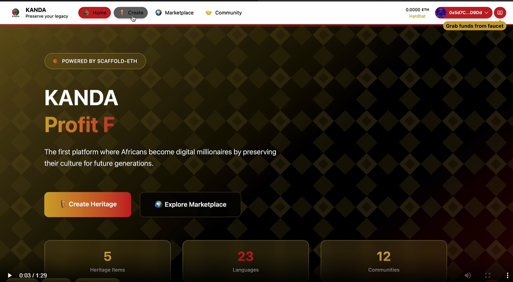
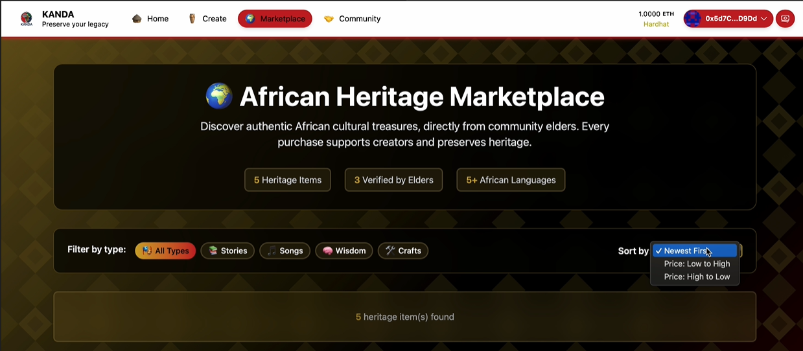
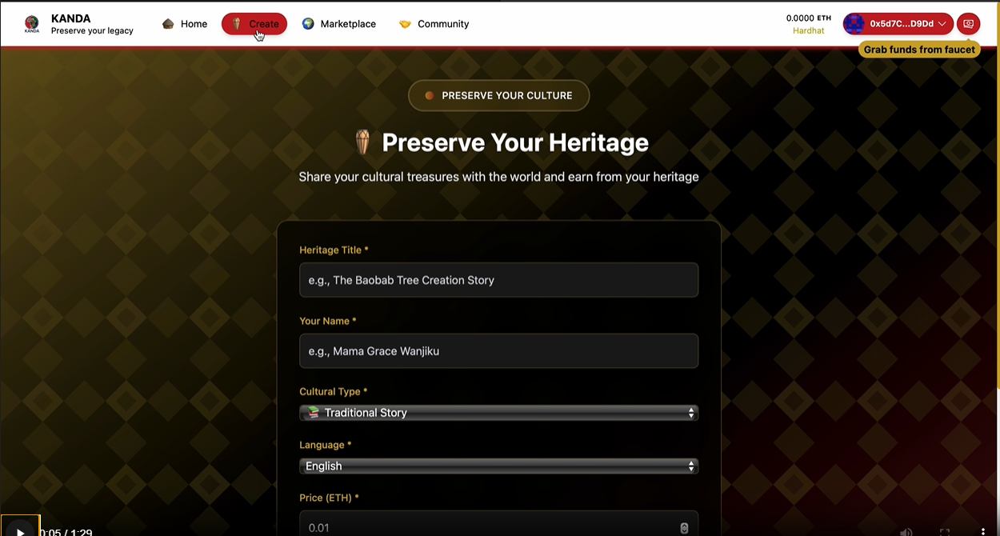
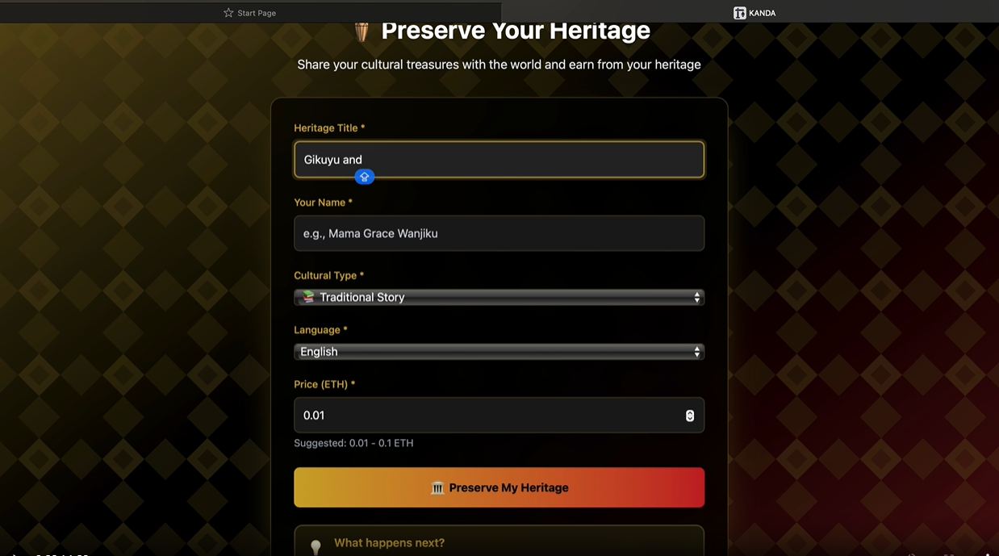
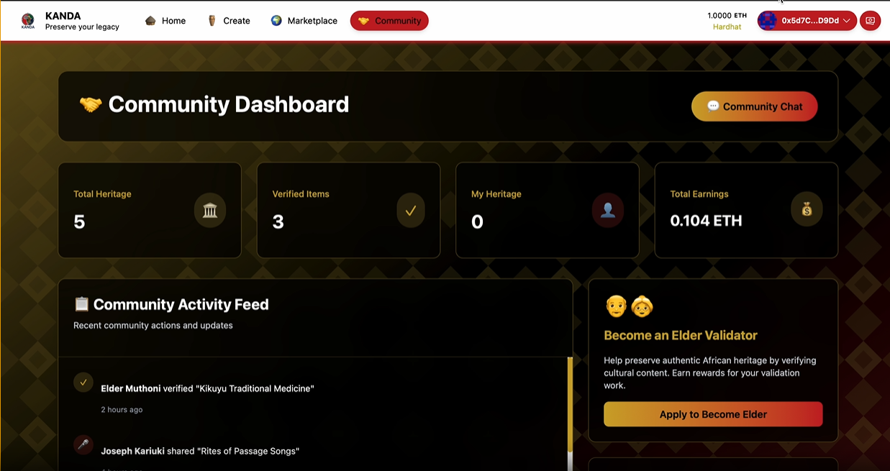
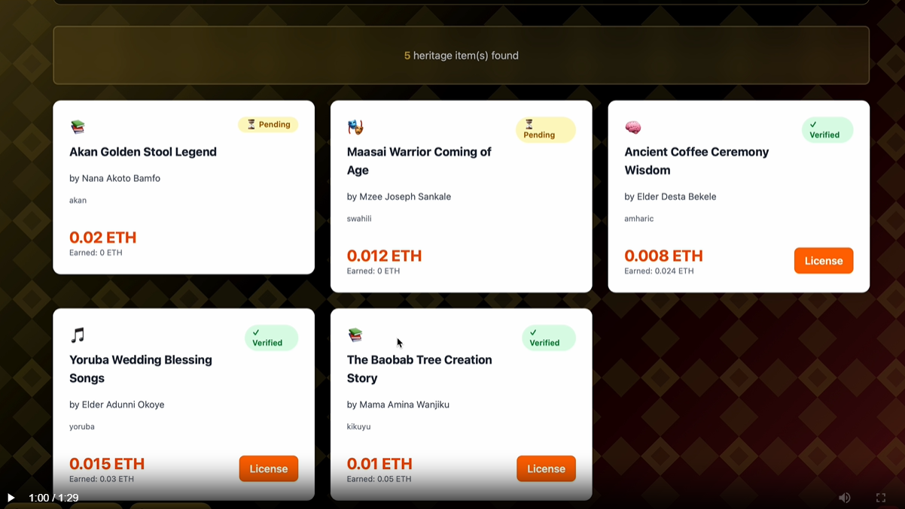
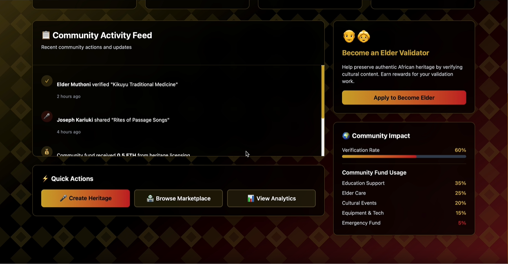
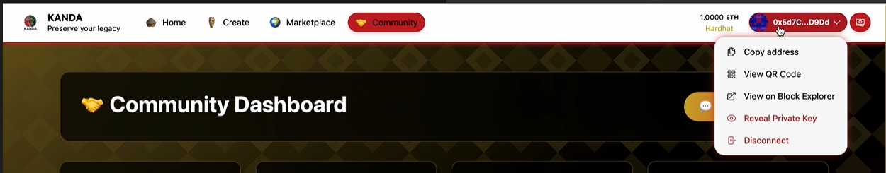

# KANDA - African Cultural Heritage NFT Platform

<p align="center">
  
</p>

## **Own Your Heritage. Preserve Your Pride. Profit From Your Past.**
> *Every African story deserves to live forever - and reward its keeper*

---

## 🔗 Quick Navigation

- [🎬 Quick Demo](#quick-demo)
- [📸 Screenshots](#screenshots)
- [🚨 The Cultural Crisis](#the-cultural-crisis-we-face-today)
- [🚀 Key Features](#-key-features)
- [🏗️ Technical Architecture](#%EF%B8%8F-technical-architecture)
- [⚙️ Quickstart](#quickstart)
- [✅ TODO](#-todo)

---

<a id="quick-demo"></a>

## 🎬 Quick Demo

Note: To keep pushes fast, the large MP4 demo may be excluded from the remote. If the inline player below does not load on GitHub, clone locally or check project releases.

- Demo video file path (for local clones):
  `acces/WhatsApp Video 2025-10-01 at 01.33.55_5708530a.mp4`

<details>
<summary>Inline preview (works when the file is present locally)</summary>

<video src="acces/WhatsApp%20Video%202025-10-01%20at%2001.33.55_5708530a.mp4" controls preload="metadata" width="100%" poster="acces/homepage.png"></video>

</details>

---

<a id="screenshots"></a>

## 📸 Screenshots

Below are selected screenshots highlighting key flows. All assets are available in `acces/`.

<p>
  
  
  
</p>
<p>
  
  
</p>
<p>
  
  
</p>
<p>
  
  
</p>

---

## ✅ TODO

- Implement governance-based split (40/30/20/10) with transparent distribution addresses
- Add IPFS pinning and media upload flow for audio/video/images with metadata
- Require multi-validator threshold (e.g., 3-of-N) before `verified = true`
- Add dispute resolution and community governance token mechanics
- Expand i18n: language detection + translations across UI
- Improve mobile-first layouts and offline-friendly assets
- Add unit tests (Solidity + frontend) and basic analytics dashboard

## 🚨 **THE CULTURAL CRISIS WE FACE TODAY**

### **Our Heritage is Disappearing Before Our Eyes**
- 📉 **Every 14 days**, another African language dies forever
- 👴 **90% of African elders** will take their stories to the grave - unrecorded, unlicensed, unrewarded
- 🏛️ **$2.6 billion** annual revenue from "African-inspired" content goes to foreign companies, not creators
- 📱 **85% of African youth** can't name 5 traditional stories from their own community

---

## 🔥 **Why This Matters RIGHT NOW**

African cultural artifacts, traditional knowledge, and intangible heritage face **extinction** due to:
- 📉 **Cultural Erasure**: Urbanization and globalization are wiping out traditions faster than we can preserve them
- 💸 **Economic Exploitation**: Our ancestors' wisdom generates billions for others while communities stay poor  
- 🏛️ **Digital Colonialism**: Western institutions monetize African elements without compensation or credit
- 👥 **Knowledge Gap**: Elders die with untold stories while youth disconnect from their roots
- ⚖️ **No Ownership**: Zero systems to prove authenticity or claim rightful compensation for our heritage

**The Clock is Ticking**: We're not just losing stories - we're losing our identity, our economic power, and our children's birthright.

🌍 Our Vision

KANDA is more than a platform — it’s a movement. We envision a future where African culture is not just preserved but also valued globally as a source of pride, wealth, and identity. By combining blockchain technology with community-driven validation, we ensure that every story, song, and tradition becomes a living digital asset — owned by its people, accessible to the world, and rewarding to its guardians. Our goal is to transform cultural heritage from something at risk of extinction into a sustainable economy that empowers Africans and inspires generations.

---

## 🎯 **Target Users**

### **Primary**: African Heritage Creators (40+ years)
- Traditional storytellers, craftspeople, musicians
- Elders with deep cultural knowledge
- Community wisdom keepers

### **Secondary**: Cultural Institutions & Buyers
- Museums, universities, educational organizations
- Documentary filmmakers and media companies
- Global collectors of authentic cultural NFTs

### **Tertiary**: Community Facilitators
- Heritage Ambassadors (tech-savvy youth)
- Cultural organizations and NGOs
- Government cultural preservation agencies

---

## 🚀 **Key Features**

### 🎨 **Cultural Asset Minting**
- **Voice-First Interface**: Record stories in native languages with AI translation
- **Multi-Media Support**: Audio, video, images, and text documentation
- **Metadata Enrichment**: Cultural context, historical significance, usage rights
- **IPFS Storage**: Permanent, decentralized preservation

### 👥 **Community Verification System**  
- **Cross-Community Validation**: Prevents local corruption through distributed verification
- **Reputation Scoring**: Validators earn reputation tokens for accurate verifications
- **Dispute Resolution**: Community governance for contested heritage items

### 💰 **Smart Royalty Distribution**

- Current demo (implemented in contract):

```solidity
Revenue Split (Demo):
├── Creator : 60%
└── Platform Sustainability: 40%
```

- Roadmap split (governed by community DAO):

```solidity
Revenue Split (Planned):
├── Creator : 40%
├── Community Fund: 30%
├── Elder Validators: 20%
└── Platform Sustainability: 10%
```

### 🏪 **Heritage Marketplace**
- **Curated Collections**: Organized by culture, region, and type
- **Licensing Tiers**: Personal, Educational, Commercial, Exclusive usage rights
- **Global Discovery**: Multi-language search and recommendation system
- **Impact Tracking**: Show community benefit from each purchase

---

## 🏗️ **Technical Architecture**

### **Built with Scaffold-ETH2**
- **⚡ Next.js Frontend**: React-based UI with TypeScript autocompletion
- **🔗 Smart Contracts**: Solidity contracts with hot reload development
- **🌈 RainbowKit Integration**: Seamless wallet connection experience  
- **🪝 Custom Hooks**: Simplified Web3 interactions with wagmi wrappers
- **🧱 Reusable Components**: Pre-built Web3 components for rapid development

---
### **Frontend Architecture (Next.js + TypeScript)**
```typescript
packages/nextjs/
├── app/
│   ├── page.tsx                   // Landing page with problem statement
│   ├── create/page.tsx            // Heritage creation form
│   ├── marketplace/page.tsx       // Browse and license heritage
│   └── community/page.tsx         // Dashboard with integrated verification
├── components/
│   └── HeritageCard.tsx          // Reusable heritage display component
├── hooks/
│   └── useKanda.ts               // Single custom hook for all contract interactions
└── styles/
    └── globals.css               // Tailwind + custom styling
```

### **Custom Hook Architecture**
Simplified single-hook approach leveraging Scaffold-ETH2:

```typescript
useKanda() {
  ├── allHeritages           // Query all minted items
  ├── myHeritages            // User's created heritage
  ├── isValidator            // Check validator status
  ├── mintHeritage()         // Create new heritage NFT
  ├── verifyHeritage()       // Elder validation
  ├── licenseHeritage()      // Purchase and distribute payment
  └── Loading states         // isMinting, isVerifying, isLicensing
}
```
---
**KANDA** is a **blockchain-powered revolution** where Africans finally:
- **OWN** their cultural assets as verified digital property
- **PROFIT** from their heritage when others use it commercially  
- **CONTROL** how their traditions are shared with the world
- **CELEBRATE** being African with economic pride, not just cultural pride
- **PRESERVE** their legacy for children and grandchildren forever

Stop watching others get rich from your heritage. Start earning from your own stories.
- 🎙️ **Record & Mint** cultural assets (stories, music, crafts, wisdom) as verified NFTs
- 👴 **Community Validation** through multi-elder approval systems
- 💰 **Earn Royalties** when content is licensed commercially or educationally
- 🌍 **Global Access** connecting authentic African heritage with worldwide audiences
- 🏘️ **Community Benefit** automatic revenue sharing with communities and validators


## Requirements

Before you begin, you need to install the following tools:

- [Node (>= v20.18.3)](https://nodejs.org/en/download/)
- Yarn ([v1](https://classic.yarnpkg.com/en/docs/install/) or [v2+](https://yarnpkg.com/getting-started/install))
- [Git](https://git-scm.com/downloads)

## Quickstart

To get started with Scaffold-ETH 2, follow the steps below:

1. Install dependencies if it was skipped in CLI:

```
cd KANDA-scarfold
yarn install
```

2. Run a local network in the first terminal:

```
yarn chain
```

This command starts a local Ethereum network using Hardhat. The network runs on your local machine and can be used for testing and development. You can customize the network configuration in `packages/hardhat/hardhat.config.ts`.

3. On a second terminal, deploy the test contract:

```
yarn deploy
```

This command deploys a test smart contract to the local network. The contract is located in `packages/hardhat/contracts` and can be modified to suit your needs. The `yarn deploy` command uses the deploy script located in `packages/hardhat/deploy` to deploy the contract to the network. You can also customize the deploy script.

4. On a third terminal, start your NextJS app:

```
yarn start
```

Visit your app on: `http://localhost:3000`. You can interact with your smart contract using the `Debug Contracts` page. You can tweak the app config in `packages/nextjs/scaffold.config.ts`.

Run smart contract test with `yarn hardhat:test`

- Edit your smart contracts in `packages/hardhat/contracts`
- Edit your frontend homepage at `packages/nextjs/app/page.tsx`. For guidance on [routing](https://nextjs.org/docs/app/building-your-application/routing/defining-routes) and configuring [pages/layouts](https://nextjs.org/docs/app/building-your-application/routing/pages-and-layouts) checkout the Next.js documentation.
- Edit your deployment scripts in `packages/hardhat/deploy`


## 🖼️ Branding

The README uses the logo from `acces/Untitled design/1.png`. You can replace it with another option from the `acces/Untitled design` or `acces/Untitled design (1)` folders if preferred.

